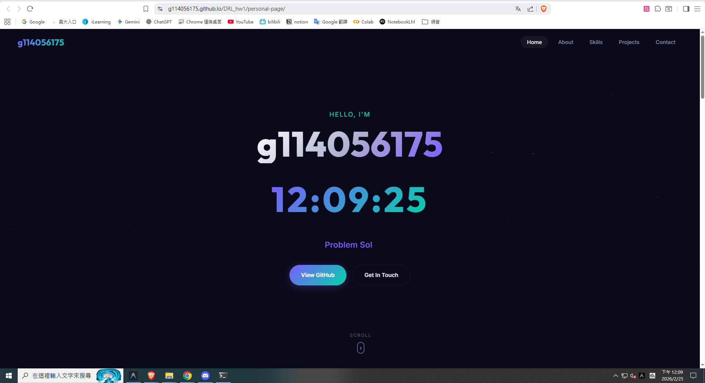

# DRL_hw1

## 🌐 Personal Web Page

A modern, visually stunning personal portfolio web page built with pure HTML, CSS, and JavaScript.

### 📝 Summary

This project is a single-page personal website created for the **DRL_hw1** assignment. The page prominently displays the project name and a **real-time clock (HH:MM:SS)** as the two primary visual elements on the hero section. It also features animated particle effects, a typewriter tagline, skill cards, project showcases, and a contact form — all wrapped in a sleek dark theme with responsive design.

The entire development process was done through AI-assisted pair programming, and the full conversation (prompts & responses) is documented in [`conversation.log`](personal-page/conversation.log).

### ✨ Features
- 🕐 **Real-time clock** displayed prominently in HH:MM:SS format
- 🌗 Dark theme with purple/teal gradient accents
- ✨ Animated floating particles background
- ⌨️ Typewriter text effect
- 📊 Animated stat counters
- 📱 Fully responsive design
- 📬 Contact form with visual feedback
- 🧭 Scroll-based navigation highlighting

### 🔗 Live Demo

👉 **[Click here to view the web page](https://g114056175.github.io/coursework/DRL/DIC1/personal-page/)**

### 📸 Preview



### 📁 Project Structure
```
personal-page/
├── index.html          # Main HTML structure
├── style.css           # Styling and animations
├── script.js           # Interactive features (clock, particles, typewriter, etc.)
└── conversation.log    # AI prompt & response log (development history)
```

### 💬 Prompt Log

The complete AI conversation log (including user prompts and assistant responses/actions) is stored in:

📄 **[`personal-page/conversation.log`](personal-page/conversation.log)**

This file documents every step of the development process — from initial page creation, to design iterations, to bug fixes and deployment.

### 🛠 Tech Stack
- HTML5
- CSS3 (Vanilla, no frameworks)
- JavaScript (ES6+)
- Google Fonts (Inter, Outfit)
