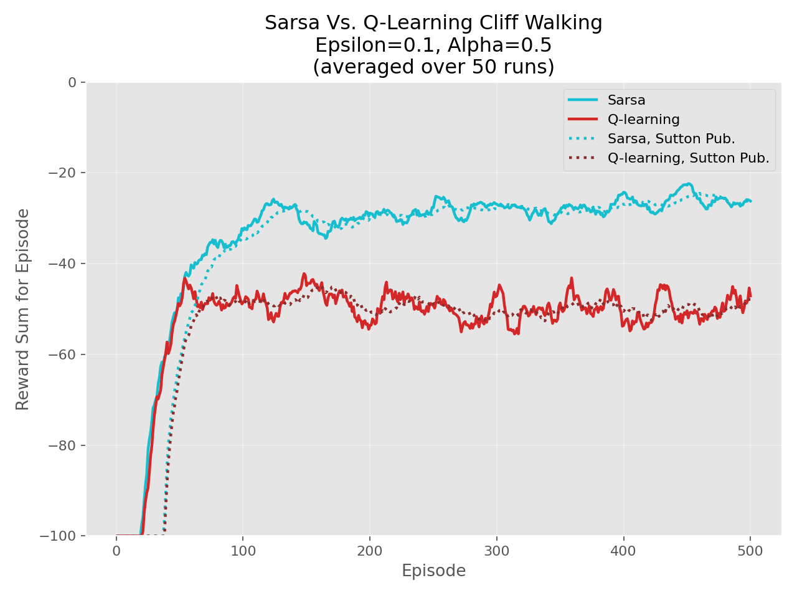
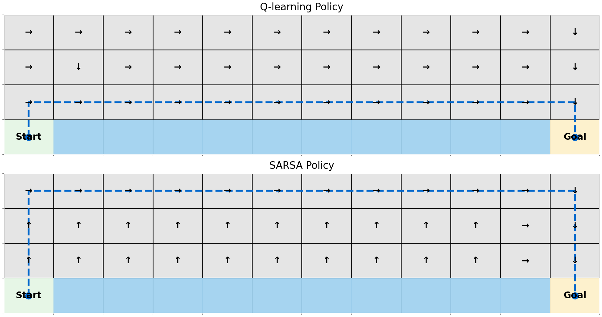

# DRL HW2: Q-learning vs SARSA on Cliff Walking

本作業比較兩種經典強化學習方法在同一個 Cliff Walking 環境中的學習行為與策略差異。

## 作業目標
- 實作 `Q-learning`（Off-policy）與 `SARSA`（On-policy）。
- 在相同設定下公平比較兩者的學習曲線與最終策略。
- 回答作業要求的理論比較與結論問題。

## 實驗設定
- Environment: Cliff Walking (`4 x 12`)
- Start: `(3, 0)`
- Goal: `(3, 11)`
- Cliff: `(3, 1) ~ (3, 10)`
- Reward: step `-1`，fall into cliff `-100` and reset to start
- Episodes: `500`
- Runs: `50`（取平均）
- Epsilon: `0.1`
- Alpha: `0.5`
- Gamma: `1.0`
- Max steps per episode: `100`

## 執行方式
```bash
py -m pip install -r requirements.txt
py run_experiment.py --episodes 500 --runs 50 --alpha 0.5 --gamma 1.0 --epsilon 0.1 --max-steps-per-episode 100 --seed 42
```

## 結果圖
### 1) Reward Comparison（仿老師格式）


### 2) 最終策略比較（箭頭 + 路徑）


## 五、理論比較與討論
### Q-learning 為離策略（Off-policy）
- 更新目標使用下一狀態的最佳可能行動：
- `Q(s,a) <- Q(s,a) + alpha * [r + gamma * max_a' Q(s',a') - Q(s,a)]`
- 即使這個最佳動作在當下沒有真的被執行，更新仍使用它。

### SARSA 為同策略（On-policy）
- 更新目標使用實際採取的下一動作：
- `Q(s,a) <- Q(s,a) + alpha * [r + gamma * Q(s',a') - Q(s,a)]`
- 因為 `a'` 是 epsilon-greedy 實際選出的動作，所以探索風險會直接反映到更新值。

### 一般理論含意
- Q-learning 較傾向學到理論最優（通常更短）路徑，但探索期間可能更冒險。
- SARSA 較傾向學到在實際探索政策下較安全、穩健的行為。

## 六、結論要求（本實驗）
### 1) 哪一種方法收斂較快
- 兩者在前段都快速改善。
- 本實驗圖中 SARSA 前段提升幅度較快，但中後段仍有波動；Q-learning 進入較穩定但回報較低的區間。

### 2) 哪一種方法較穩定
- 依圖形可見，Q-learning 的曲線帶較集中，SARSA 仍有較明顯起伏。
- 但 SARSA 在平均回報（較不負）上通常較好。

### 3) 在何種情境下應選擇 Q-learning 或 SARSA
- 選 Q-learning: 重視理論最優策略、可接受探索風險。
- 選 SARSA: 重視訓練/部署安全性、希望策略反映探索風險並偏保守。

## 附件與紀錄
- 作業規格書: [docs/spec.md](docs/spec.md)
- 工程流程: [docs/engineering_workflow.md](docs/engineering_workflow.md)
- 作業相關對話紀錄: [conversation.log](conversation.log)
